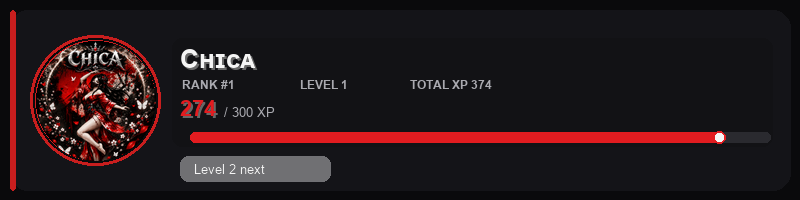
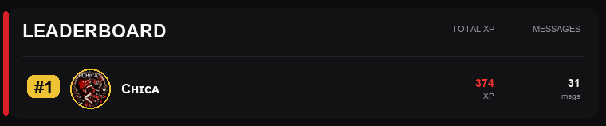

<div align="center">

<!-- Animated Banner -->


<!-- Typing Animation -->
<a href="https://git.io/typing-svg">
  
</a>

<br/>

<!-- Badges -->


</div>

---

<div align="center">

## ✦ What is Chroma AI?

</div>

> **Chroma AI** is a private Discord bot built to combine moderation, automation, verification, and advanced server protection into one unified system. Forget juggling five bots — Chroma handles it all with smart tools, cleaner server management, and hardened security.

---

<div align="center">

## ⚡ Feature Overview

</div>

<table>
<tr>
<td width="50%" valign="top">

### 🤝 Community & Automation
```
✦ Welcome messages
✦ Auto roles & reaction roles
✦ Custom commands
✦ Scheduled announcements
✦ Leveling, XP & rank rewards
✦ Ticket system
✦ Utility tools & help system
```

</td>
<td width="50%" valign="top">

### 🔨 Moderation
```
✦ Warning system
✦ Timeout, mute, kick & ban
✦ Temporary punishments
✦ Anti-spam & anti-link filters
✦ Keyword & profanity filtering
✦ Purge / bulk delete
✦ Moderation & audit logs
```

</td>
</tr>
<tr>
<td width="100%" valign="top" colspan="2">

### 🛡️ Security
```
✦ Verification system       ✦ Anti-raid & anti-nuke       ✦ Rogue admin protection
✦ Webhook protection        ✦ Scam & phishing protection  ✦ Lockdown tools
✦ Backup & restore systems  ✦ Whitelist system
```

</td>
</tr>
</table>

---

<div align="center">

## 🖼️ Previews

</div>

<table>
<tr>
<td width="50%" align="center">

**Rank Card**



</td>
<td width="50%" align="center">

**Leaderboard**



</td>
</tr>
</table>


---

<div align="center">

## 🚀 Commands

</div>

### Core

| Command | Description |
|:--------|:------------|
| `/help` | Display available commands and guidance |
| `/setup` | Configure core server settings |
| `/verify` | Start or manage member verification |
| `/botstatus` | Show bot status, uptime, and latency |
| `/rank` | View your XP, level, and server rank |
| `/leaderboard` | See the top chatters by XP |

<details>
<summary><b>⚙️ Settings & Configuration Commands</b></summary>

<br/>

```
/settings welcome
/settings logs
/settings status
/settings changelog
/settings botchannel-add
/settings botchannel-remove
/settings botchannels
/settings levelups
/verification setup
```

</details>

<details>
<summary><b>🔨 Moderation Commands</b></summary>

<br/>

```
/purge amount:25 reason:Clean up chat
/warn  /warnings  /clearwarnings
/timeout  /mute  /unmute  /kick  /ban  /unban
/modlogs status
/modlogs configure channel:#mod-logs enabled:True
```

`/purge` removes 1–100 messages and requires Administrator permission, or an `Admin` / `Administrator` role. Prefix fallback: `!purge 25` or `!clear 25`.

</details>

<details>
<summary><b>🛡️ AutoMod Commands</b></summary>

<br/>

```
/antispam status
/antispam configure enabled:True message_limit:6 duplicate_limit:4 window_seconds:8 timeout_minutes:10

/antilink status
/antilink configure enabled:True timeout_minutes:10 block_invites:True block_general_links:True allow_media:True

/keyword status
/keyword configure enabled:True timeout_minutes:3
/keyword add keyword:blocked phrase
/keyword list

/profanity configure enabled:True timeout_minutes:3

/logs setup channel:#mod-logs enabled:True
/logs events warnings:True punishments:True member_bans:True member_mutes:True member_kicks:True role_updates:True role_removals:True automod:True security:True message_deletes:False message_edits:False
/logs status
/logs test
```

Anti-link allows Discord CDN GIFs/images/videos, Tenor, Giphy, and Imgur direct media by default when `allow_media:True`.

</details>

<details>
<summary><b>🔒 Security Commands</b></summary>

<br/>

```
/antiraid status
/antiraid configure enabled:True joins_per_window:8 window_seconds:20
/antiraid mode enabled:False

/antinuke status
/antinuke configure enabled:True action_limit:5 window_seconds:20 webhook_protection:True

/rogueadmin status
/rogueadmin configure enabled:True

/webhookprotection status
/webhookprotection configure enabled:True

/scamfilter status
/scamfilter configure enabled:True
/scamfilter add phrase:verify your wallet

/backup create
/backup list
/restore settings backup_file:data/backups/YOUR-BACKUP.json
```

Anti-nuke watches channel deletes, role deletes, member bans, member kicks, and webhook creation. Rogue admin protection removes newly granted Administrator permissions from roles. The bot needs View Audit Log, Manage Roles, Manage Webhooks, and a role above any staff roles it may need to strip.

</details>

<details>
<summary><b>🎭 Reaction Roles</b></summary>

<br/>

Post a grouped role panel with one command:

```text
/reactionrole post channel:#roles title:Choose Roles category:Game Roles options:🎮 | @Gamer | Game nights and gaming pings
🎨 | @Artist | Art shares and creative events
📢 | @Updates | Server announcement pings

/reactionrole list
/reactionrole list category:Game Roles
```

Format each option as `emoji | role | description`. Separate with new lines or semicolons. Role can be a mention, ID, or exact name. Bot role must sit above every role it assigns.

</details>

<details>
<summary><b>🎫 Ticket System</b></summary>

<br/>

```text
/ticket setup channel:#support support_role:@Support
/ticket logs channel:#ticket-logs enabled:True
/ticket log
/ticket list
/ticket close
```

Setup posts a button in the chosen channel. When a member clicks it, the bot creates a private channel visible only to that member, the bot, and the support role. Open and close events log to the configured ticket log channel.

</details>

<details>
<summary><b>💬 Custom Commands</b></summary>

<br/>

```text
/custom add name:rules response:Read #rules before chatting.
/custom list
/custom status
/custom debug name:rules channel:#general
/custom channel-add channel:#bot-commands
/custom channels
/custom channel-remove channel:#bot-commands

!rules
/command name:rules
```

Custom commands work in all channels by default. Restrict them by adding allowed channels with `/custom channel-add`. Members can also trigger them via the `!` prefix or `/command`.

</details>

<details>
<summary><b>📣 Changelog & Status Panel</b></summary>

<br/>

```text
/settings status channel:#bot-status enabled:True
/settings changelog channel:#bot-updates enabled:True

/changelog post title:New Feature description:Added warning IDs and public warn embeds.
/changelog list
```

The bot creates one persistent status panel and edits it on startup/shutdown rather than posting a new message every reboot. Offline status only updates on a clean shutdown — force kills or power loss will leave it showing online.

</details>

---

<div align="center">

## 🗺️ Roadmap

</div>

```
Phase 1 ████████████████████ ✅  Core structure, slash commands, logging
Phase 2 ████████████████████ ✅  Moderation, automod, welcome & roles
Phase 3 ████████████████████ ✅  Leveling, tickets, announcements & commands
Phase 4 ░░░░░░░░░░░░░░░░░░░░ 🔄  Anti-raid, anti-nuke, backup systems
```

<details>
<summary><b>📋 View Full Roadmap Details</b></summary>

<br/>

**Phase 1** — Foundation
- Set up core bot structure
- Add secure environment configuration
- Build starter slash commands
- Add basic logging and error handling

**Phase 2** — Moderation
- Add moderation commands
- Add automod filters
- Add welcome messages and auto roles
- Add `/help`, `/setup`, and `/verify`

**Phase 3** — Engagement
- Add leveling, rewards, and utility systems
- Add scheduled announcements
- Ticket system and custom commands

**Phase 4** — Security Hardening
- Add anti-raid systems
- Add anti-nuke protection
- Add advanced verification and lockdown tools
- Add backup and recovery systems

</details>

---

<div align="center">

## 🔑 Invite Permissions

</div>

| Permission | Required for |
|:-----------|:-------------|
| Manage Roles | Auto roles, reaction roles, anti-nuke |
| Manage Channels | Ticket creation, lockdown |
| Manage Messages | Purge, automod deletions |
| Moderate Members | Timeout commands |
| Kick Members | Kick command |
| Ban Members | Ban command |
| View Audit Log | Anti-nuke, rogue admin detection |
| Manage Webhooks | Webhook protection |
| Read Message History | Purge, leveling |
| Send Messages | All responses |
| Use Slash Commands | All slash commands |

> Keep the bot role **above** any roles it needs to assign or moderate.

---

<div align="center">

## 🎯 Project Goal

</div>

> Chroma AI aims to become the **single Discord bot** that can handle utility, moderation, engagement, verification, and protection — all in one project. No patchwork of external bots. One system, total control.

---

<div align="center">

**© Chroma AI — Private Project. All Rights Reserved.**


</div>
